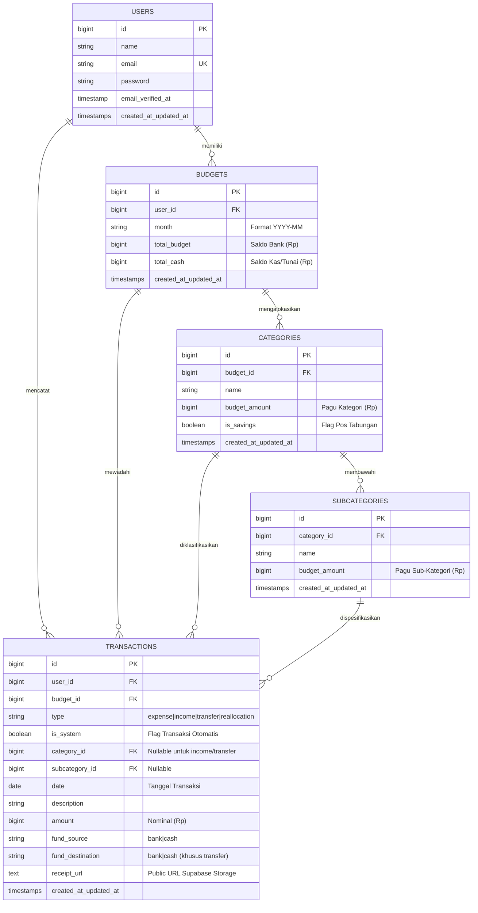
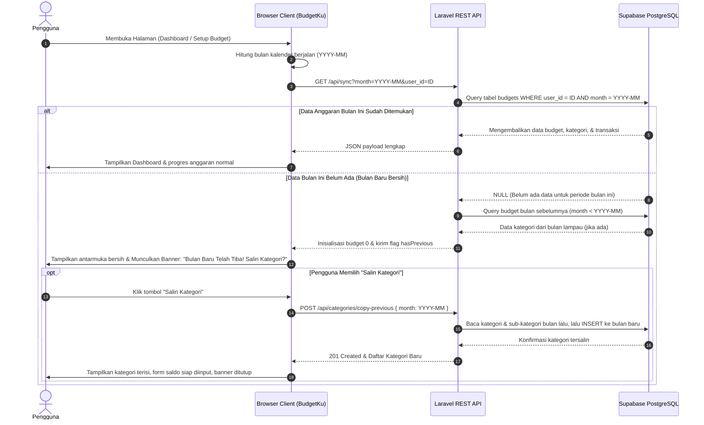
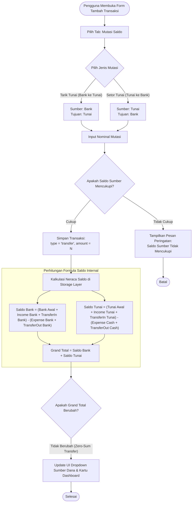

# 📄 Product Requirements Document (PRD) — BudgetKu

---

## 📌 Dokumen Informasi
- **Nama Produk**: BudgetKu
- **Tipe Aplikasi**: *Personal Finance Management & Cash Flow Tracker Web Application*
- **Versi Rilis**: 2.0 (Arsitektur Supabase Cloud Database & Multi-Source Fund Tracking)
- **Status Dokumen**: Disetujui (*Approved & Implemented*)
- **Penulis**: Lead Engineer & Software Architect
- **Target Repositori**: `aplikasi-manajemen-uang`

---

## 1. Product Overview

### 1.1 Deskripsi Produk
**BudgetKu** adalah platform aplikasi web manajemen keuangan pribadi (*personal finance management*) yang modern, terintegrasi secara *real-time*, intuitif, dan aman. Aplikasi ini dirancang untuk memberikan kendali menyeluruh kepada pengguna dalam merencanakan anggaran bulanan, memantau arus kas (*cash flow*), melacak transaksi harian (pengeluaran, pemasukan, dan mutasi saldo), serta menganalisis performa kesehatan finansial melalui visualisasi data interaktif.

Sistem BudgetKu mengusung pendekatan alokasi multi-sumber dana (*dual-balance tracking*) yang memisahkan pencatatan saldo digital (Bank/E-Wallet) dan uang fisik (Tunai/Cash), serta mendukung metode penganggaran berbasis amplop digital (*envelope budgeting*) dan prinsip 50/30/20.

### 1.2 Tujuan Utama (Product Goals)
1. **Visibilitas Finansial Komprehensif**: Memberikan representasi saldo riil pengguna di seluruh kantong penyimpanan dana (Bank dan Kas Fisik) tanpa distorsi pencatatan.
2. **Disiplin Anggaran & Pencegahan Defisit**: Menyediakan mekanisme kontrol pagu anggaran per kategori/sub-kategori, indikator peringatan overbudget, dan alur realokasi anggaran otomatis (*budget reallocation audit trail*).
3. **Automasi Transisi Periode Finansial**: Mengotomatisasi alur pergantian bulan (*Month Rollover*) dengan penyalinan struktur kategori dari bulan sebelumnya guna meminimalkan friksi administrasi pengguna.
4. **Keamanan & Isolasi Data Multi-User**: Menjamin pemisahan data setiap pengguna secara ketat (*user scoping*) di tingkat database PostgreSQL Supabase dengan autentikasi berbasis email OTP dan enkripsi kata sandi Bcrypt.
5. **Akuntabilitas Transaksi**: Menyediakan pencatatan bukti fisik melalui unggahan struk/faktur ke *cloud storage* serta ekspor laporan berkala dalam format standar (CSV & PDF).

### 1.3 Target Pengguna
- **Profesional & Pekerja Mandiri (*Freelancer*)**: Individu dengan variasi pemasukan dan pengeluaran reguler yang memerlukan pemisahan arus dana digital dan tunai.
- **Mahasiswa & Pengatur Keuangan Pemula**: Pengguna yang ingin membangun kebiasaan mencatat keuangan dengan antarmuka yang bersih, cepat (*low latency*), dan bebas dari iklan.
- **Pengelola Keuangan Rumah Tangga**: Pengguna yang membutuhkan pembagian pos pengeluaran terperinci hingga level sub-kategori (misal: Kebutuhan Pokok › Bahan Makanan, Listrik, Air).

---

## 2. Tech Stack

Arsitektur aplikasi BudgetKu dibangun dengan model *Hybrid Fullstack*: backend mengandalkan framework PHP modern berbasis RESTful API, sedangkan frontend memadukan rendering Blade terstruktur dengan *client-side reactive controllers* berbasis JavaScript murni (Vanilla JS) yang terhubung langsung ke Supabase SDK dan REST endpoints.

| Lapisan Sistem | Teknologi / Pustaka | Versi | Peran & Tanggung Jawab |
|---|---|---|---|
| **Backend Framework** | [Laravel](https://laravel.com) | 12.x | REST API routing, validasi request, ORM Eloquent, mailer engine, dan scoping sesi pengguna. |
| **Runtime Bahasa** | [PHP](https://php.net) | 8.2+ | Lingkungan eksekusi server-side backend. |
| **Database Relasional** | [Supabase](https://supabase.com) (PostgreSQL) | 15+ | Penyimpanan relasional tabel pengguna, anggaran, kategori, dan transaksi dengan skema terindeks. |
| **Autentikasi & Otorisasi** | Supabase Auth & Laravel Cache | GoTrue / Custom | Autentikasi pendaftaran OTP email 2-langkah, verifikasi login, serta pemulihan kata sandi. |
| **Cloud Storage** | Supabase Storage Bucket (`receipts`) | v1 API | Penyimpanan berkas foto struk pembayaran berstatus *public bucket*. |
| **Realtime Engine** | Supabase Realtime (WebSocket) | v2 Client | Sinkronisasi multi-tab/perangkat secara langsung via *Postgres Changes Listener*. |
| **Templating Engine** | Laravel Blade | Bawaan | Struktur layout HTML semantik, partial view komponen, dan injeksi *meta-tags*. |
| **Frontend Styling** | [Bootstrap](https://getbootstrap.com) | 5.3.3 | Desain responsif, utility class, modal dialog, collapse accordion, dan flexbox layout. |
| **Pustaka Ikon** | [Bootstrap Icons](https://icons.getbootstrap.com) | 1.11.3 | Simbol visual antarmuka pengguna (`bi-*`). |
| **Logika Frontend** | Vanilla JavaScript (ES6 Modules) | ES2022+ | Orkestrasi state in-memory, synchronous DOM updates, manipulasi form, dan kalkulasi saldo. |
| **Visualisasi Data** | [Chart.js](https://www.chartjs.org/) | 4.x (UMD) | Rendering diagram donat komposisi anggaran dan *smooth line area charts* harian. |
| **Komponen Dropdown UI** | [Tom Select](https://tom-select.js.org/) | 2.3.1 | Dropdown interaktif dengan pencarian cepat untuk kategori transaksi dan filter data. |
| **Build Tool & Bundler** | [Vite](https://vitejs.dev/) | 7.x | Kompilasi aset frontend dan Hot Module Replacement (HMR). |
| **Serverless Deployment** | [Vercel](https://vercel.com) (Runtime: `vercel-php`) | Serverless | Konfigurasi serverless hosting via rewrite `vercel.json` dan boot wrapper `api/index.php`. |

---

## 3. Key Features (Core Modules)

### 3.1 Dashboard Analytics
Modul Dashboard merupakan pusat kendali informasi keuangan bulanan pengguna yang menyajikan ringkasan metrik secara instan:
- **3 Kartu Ringkasan Finansial Utama**:
  1. *Total Budget*: Menampilkan akumulasi alokasi awal bulan dari Saldo Bank dan Uang Tunai. Jika ada pemasukan berjalan, sistem menampilkan catatan tambahan (`+ Rp X dari pemasukan`).
  2. *Total Pengeluaran*: Menampilkan total seluruh pengeluaran murni pada bulan berjalan (mengecualikan mutasi saldo dan transaksi sistem).
  3. *Sisa Budget*: Menghitung kapasitas saldo efektif dikurangi total pengeluaran. Kartu dilengkapi catatan pemecahan saldo riil:
     $$\text{Sisa Digital (Bank)} \quad \text{dan} \quad \text{Sisa Fisik (Tunai)}$$
     Jika nilai sisa bernilai negatif, kartu otomatis beralih status visual menjadi *Overbudget* dengan latar belakang merah menyala.
- **Grafik Donat Alokasi Kategori**: Diagram lingkaran Chart.js yang memvisualisasikan rasio rencana pembagian anggaran per pos kategori utama.
- **Progress Kategori dengan Progressive Disclosure (Bootstrap Collapse)**:
  - Batang kemajuan (*progress bar*) interaktif per kategori dengan perhitungan persentase pemakaian pagu.
  - Skema warna adaptif:
    - $\le 60\%$: Hijau Aman (`bg-safe`)
    - $61\% - 90\%$: Kuning Waspada (`bg-caution`)
    - $> 90\%$: Merah Kritis (`bg-over`)
  - *Perlakuan Khusus Pos Tabungan*: Kategori dengan atribut `is_savings: true` tetap mempertahankan status warna hijau (`bg-safe`) meskipun telah mencapai atau melampaui 100%, karena menabung melebihi target merupakan indikator finansial positif.
  - *Progressive Disclosure*: Menampilkan tombol toggle chevron *"Lihat Rincian"* yang dapat diklik untuk membuka sub-kategori (*drawer accordion*). Sub-kategori menampilkan progres pengeluaran dan sisa saldo masing-masing secara terperinci.
- **Grafik Tren Finansial Harian (Double Line Charts)**:
  - *Tren Pengeluaran Harian*: Area line chart bergradasi biru yang memetakan akumulasi pengeluaran dari tanggal 1 hingga akhir bulan, dilengkapi indikator rata-rata per hari dan titik puncak pengeluaran tertinggi.
  - *Tren Pemasukan Harian*: Area line chart bergradasi hijau yang memetakan arus dana masuk harian beserta statistik rata-rata dan nilai puncaknya.
- **Daftar Transaksi Terakhir**: Tabel ringkas 5 transaksi terbaru bulan berjalan dengan pagination mikro.

### 3.2 Setup Budget (Perencanaan Anggaran Bulanan)
Modul ini bertindak sebagai fondasi perencanaan keuangan sebelum transaksi dicatat:
- **Pemisahan Saldo Bank & Tunai**:
  - Menyediakan dua kolom input mandiri berformat mata uang Rupiah: *Saldo Bank / E-Wallet* dan *Uang Tunai (Cash)*.
  - Nilai tersimpan ke database dalam kolom `total_budget` (Bank) dan `total_cash` (Tunai).
  - Grand Total Budget dihitung dari penjumlahan kedua instrumen dana tersebut.
- **Alokasi Pagu Kategori & Sub-Kategori**:
  - Pengguna dapat membuat pos kategori pengeluaran (misal: Makanan, Transportasi, Hiburan, Tabungan Darurat).
  - Dukungan penambahan sub-kategori dinamis tanpa batas dengan fitur *Auto-Summation*: Jika sub-kategori diisi, pagu kategori induk otomatis terkunci dan nilainya merupakan hasil akumulasi sub-kategori.
  - Penandaan opsi *Pos Tabungan / Investasi* (`cat-is-savings`).
- **Floating Allocation Summary Bar**:
  - Bilah indikator alokasi yang terkunci rapi di bagian bawah layar (*fixed bottom*).
  - Memberikan umpan balik instan: *Sesuai Budget* (biru), *Alokasi Pas 100%* (hijau), atau *Over Budget* (merah) jika total alokasi melebihi kapasitas dana.
- **Month Rollover & Smart Copy Banner**:
  - Sistem mendeteksi secara otomatis apakah bulan kalender saat ini sudah memiliki data anggaran di database.
  - Jika bulan baru belum diatur, sistem memunculkan banner interaktif yang menawarkan opsi menyalin (*copy previous*) seluruh daftar kategori dan sub-kategori dari bulan sebelumnya dalam satu klik.

### 3.3 Tracker Harian (Pencatatan & Pelacakan Transaksi)
Pusat pencatatan harian yang mendukung tiga mode transaksi melalui antarmuka tab terpadu:
- **1. Mode Pengeluaran (*Expense*)**:
  - Mencatat beban belanja harian dengan memotong pagu kategori/sub-kategori yang dipilih serta memotong saldo sumber dana terkait (Bank atau Tunai).
  - Wajib memilih kategori. Jika kategori berlabel tabungan dipilih, formulir mengharuskan centang konfirmasi alokasi tabungan.
  - *Mekanisme Intersepsi Overbudget*: Jika nominal belanja melebihi sisa pagu kategori atau sub-kategori, sistem mencegat proses simpan dan menampilkan modal **Peringatan Overbudget**. Pengguna diarahkan untuk memindahkan kekurangan (*deficit*) dari pos lain yang masih memiliki saldo positif.
  - *Audit Trail Realokasi*: Perpindahan saldo otomatis mencatatkan entri transaksi sistem bertipe `reallocation` (`is_system = true`) agar historis pergeseran anggaran tercatat transparan.
- **2. Mode Pemasukan Tambahan (*Income*)**:
  - Mencatat arus kas masuk (gaji tambahan, dividen, bonus, cashback) yang langsung menambah saldo sumber dana (Bank atau Tunai) dan memperluas kapasitas total budget tanpa memotong kategori pengeluaran.
- **3. Mode Mutasi Saldo (*Transfer*)**:
  - Memfasilitasi perpindahan dana internal:
    - *Tarik Tunai*: Saldo Bank berkurang, Saldo Uang Tunai bertambah.
    - *Setor Tunai*: Saldo Uang Tunai berkurang, Saldo Bank bertambah.
  - Dilengkapi validasi kecukupan saldo instrumen pengirim.
  - **Penting**: Mutasi saldo tidak dihitung sebagai beban pengeluaran dan tidak mengubah nilai Grand Total saldo pengguna.
- **Pengunggahan Bukti Pembayaran / Struk**:
  - Area drag-and-drop berkas gambar (.jpg, .jpeg, .png maksimal 1-2 MB).
  - Gambar dikirim ke backend lalu diunggah ke Supabase Storage via `SupabaseStorageService`.
  - Pratinjau struk dapat dibuka dalam dialog modal resolusi tinggi.
- **Pencarian, Filter, & Ekspor Laporan**:
  - Filter multi-kriteria: Tipe transaksi, Kategori (didukung Tom Select), dan rentang tanggal kalender.
  - Tombol ekspor ke berkas **Excel / CSV** (dengan *BOM UTF-8* untuk pembacaan akurat di Microsoft Excel) dan cetak langsung ke format **PDF** melalui stylesheet cetak bawaan browser.

### 3.4 Arsip (Penyimpanan Data Historis)
- Menampilkan rekapan data bulan-bulan terdahulu yang telah ditutup (`month != currentMonth`).
- Kartu ringkasan bulanan dengan label performa:
  - **Hemat**: Jika $\text{Total Pengeluaran} \le \text{Total Budget}$.
  - **Overbudget**: Jika $\text{Total Pengeluaran} > \text{Total Budget}$.
- Menampilkan rincian riwayat: diagram donat komposisi pengeluaran bulan lampau, progress bar kategori, tabel lengkap transaksi lampau, dan tombol unduh laporan CSV khusus bulan bersangkutan.

---

## 4. Database Schema & Supabase API Integration

### 4.1 Skema Tabel Database (PostgreSQL)

Aplikasi BudgetKu beroperasi di atas skema relasional dengan integritas data berbasis *Foreign Key Cascading* dan indeks teroptimasi.



#### Rincian Kolom & Definisi Data

1. **Tabel `users`**:
   - `id`: Primary key bertipe auto-incrementing integer / bigint.
   - `name`: Nama lengkap pengguna (varchar 255).
   - `email`: Alamat email pengguna, bersifat unik (`unique index`).
   - `password`: String hash kata sandi menggunakan Bcrypt (`$2y$...`).
   - `email_verified_at`: Penanda verifikasi email pendaftaran.

2. **Tabel `budgets`**:
   - `id`: Primary key.
   - `user_id`: Foreign key ke `users.id` dengan relasi `onDelete('cascade')`.
   - `month`: String periode dengan panjang 7 karakter (contoh: `'2026-08'`).
   - `total_budget`: Nominal alokasi saldo Bank / E-Wallet dalam satuan Rupiah (bigint, default 0).
   - `total_cash`: Nominal alokasi saldo Uang Tunai / Cash dalam satuan Rupiah (bigint, default 0).
   - *Index*: `unique(['user_id', 'month'])`, memastikan satu pengguna hanya memiliki satu baris entri per periode bulan.

3. **Tabel `categories`**:
   - `id`: Primary key.
   - `budget_id`: Foreign key ke `budgets.id` dengan relasi `onDelete('cascade')`.
   - `name`: Nama pos pengeluaran kategori (varchar 255).
   - `budget_amount`: Batas pagu anggaran yang direncanakan untuk kategori tersebut (bigint, default 0).
   - `is_savings`: Boolean flag penanda apakah kategori difungsikan sebagai pos tabungan/investasi (default: `false`).

4. **Tabel `subcategories`**:
   - `id`: Primary key.
   - `category_id`: Foreign key ke `categories.id` dengan relasi `onDelete('cascade')`.
   - `name`: Nama sub-pos anggaran (varchar 255).
   - `budget_amount`: Nominal pagu sub-kategori dalam Rupiah (bigint, default 0).

5. **Tabel `transactions`**:
   - `id`: Primary key.
   - `user_id`: Foreign key ke `users.id` (`onDelete('cascade')`).
   - `budget_id`: Foreign key ke `budgets.id` (`onDelete('cascade')`).
   - `type`: Tipe transaksi (`enum / varchar`): `'expense'` (beban), `'income'` (pendapatan), `'transfer'` (mutasi antar saldo), atau `'reallocation'` (audit pemindahan saldo).
   - `is_system`: Boolean flag penanda apakah transaksi dibuat secara otomatis oleh sistem (transaksi berstatus sistem terkunci dari aksi edit/hapus manual).
   - `category_id`: Foreign key ke `categories.id` (bersifat `nullable` untuk transaksi bertipe income atau transfer).
   - `subcategory_id`: Foreign key ke `subcategories.id` (`nullOnDelete()`, bersifat opsional).
   - `date`: Tanggal efektif transaksi (format `YYYY-MM-DD`).
   - `description`: Deskripsi atau keterangan transaksi.
   - `amount`: Nominal transaksi dalam Rupiah (integer positif $> 0$).
   - `fund_source`: **(Kolom Baru)** Sumber dana asal transaksi (`'bank'` atau `'cash'`).
   - `fund_destination`: **(Kolom Baru)** Sumber dana tujuan transaksi khusus tipe transfer (`'bank'` atau `'cash'`, bernilai `null` untuk pengeluaran biasa).
   - `receipt_url`: URL publik berkas struk di Supabase Storage.
   - *Index Terpasang*: `['budget_id', 'date']`, `['category_id', 'date']`, dan `date`.

---

### 4.2 Dokumentasi REST API Endpoints & Supabase Client

Aplikasi BudgetKu berkomunikasi melalui antarmuka REST API yang dikelola oleh `App\Http\Controllers\ApiController` serta akses langsung via `Supabase JS SDK v2`.

#### 1. Sinkronisasi Kilat Seluruh Aplikasi (Unified Sync)
- **Endpoint**: `GET /api/sync`
- **Query Parameters**:
  - `month`: String periode (contoh: `2026-08`, default: bulan saat ini).
  - `user_id`: ID numerik pengguna aktif.
- **Respons (200 OK)**:
  ```json
  {
    "budget": {
      "id": "12",
      "month": "2026-08",
      "totalBudget": 5000000,
      "totalCash": 1500000,
      "total_budget": 5000000,
      "total_cash": 1500000,
      "categories": [
        {
          "id": "34",
          "name": "Kebutuhan Pokok",
          "budget": 3000000,
          "isSavings": false,
          "is_savings": false,
          "subcategories": [
            { "id": "78", "name": "Bahan Makanan", "budget": 2000000 },
            { "id": "79", "name": "Listrik & Air", "budget": 1000000 }
          ]
        }
      ]
    },
    "transactions": [
      {
        "id": "101",
        "type": "expense",
        "fund_source": "bank",
        "fundSource": "bank",
        "fund_destination": null,
        "is_system": false,
        "date": "2026-08-25",
        "categoryId": "34",
        "subcategoryId": "78",
        "description": "Belanja Bulanan Supermarket",
        "amount": 450000,
        "hasReceipt": true,
        "receiptUrl": "https://xyz.supabase.co/storage/v1/object/public/receipts/receipt_123.jpg",
        "createdAt": "2026-08-25T10:15:30.000000Z"
      }
    ],
    "archives": []
  }
  ```

#### 2. Anggaran Bulanan (Budget Setup)
- **GET `/api/budget`**: Mengambil pagu anggaran bulan aktif.
- **POST `/api/budget`**: Menyimpan atau memperbarui alokasi saldo Bank dan Tunai.
  - **Payload**:
    ```json
    {
      "month": "2026-08",
      "amount": 5000000,
      "total_budget": 5000000,
      "total_cash": 1500000,
      "user_id": 1
    }
    ```
  - **Respons (200 OK)**:
    ```json
    {
      "success": true,
      "totalBudget": 5000000,
      "totalCash": 1500000,
      "month": "2026-08"
    }
    ```

#### 3. Manajemen Kategori & Sub-Kategori
- **POST `/api/categories`**: Menambah kategori baru beserta rincian sub-kategori.
  - **Payload**:
    ```json
    {
      "month": "2026-08",
      "name": "Tabungan Masa Depan",
      "budget": 1000000,
      "is_savings": true,
      "subcategories": [
        { "name": "Reksadana", "budget": 600000 },
        { "name": "Emas Logam Mulia", "budget": 400000 }
      ],
      "user_id": 1
    }
    ```
- **POST `/api/categories/copy-previous`**: Menyalin seluruh kategori dari bulan sebelumnya ke bulan target.
  - **Payload**:
    ```json
    {
      "month": "2026-09",
      "user_id": 1
    }
    ```
- **PUT `/api/categories/{id}`**: Memperbarui nama, pagu kategori, status tabungan, dan susunan sub-kategori.
- **DELETE `/api/categories/{id}`**: Menghapus kategori beserta relasi sub-kategorinya secara kaskade.

#### 4. Manajemen Transaksi Keuangan
- **GET `/api/transactions`**: Mengambil daftar seluruh transaksi bulan berjalan.
- **POST `/api/transactions`**: Membuat transaksi baru dengan opsi unggah struk.
  - **Format Request**: `multipart/form-data` atau `application/json`.
  - **Field Payload**:
    | Nama Parameter | Tipe Data | Wajib/Opsional | Deskripsi |
    |---|---|---|---|
    | `type` | String | Wajib | `'expense'`, `'income'`, `'transfer'`, atau `'reallocation'` |
    | `date` | Date (YYYY-MM-DD) | Wajib | Tanggal transaksi dilakukan |
    | `fund_source` | String | Wajib | Sumber dana: `'bank'` atau `'cash'` |
    | `fund_destination`| String | Kondisional | Tujuan dana khusus tipe `'transfer'`: `'bank'` atau `'cash'` |
    | `category_id` | Integer | Kondisional | Wajib untuk tipe `'expense'`, `null` untuk `'income'` / `'transfer'` |
    | `subcategory_id` | Integer | Opsional | ID sub-kategori pengeluaran |
    | `description` | String | Wajib | Keterangan transaksi |
    | `amount` | Numeric (>= 1) | Wajib | Nominal transaksi dalam satuan Rupiah |
    | `receipt` | File Binary | Opsional | Berkas gambar struk (.jpg, .jpeg, .png maksimal 2MB) |
    | `receipt_data` | String Base64 | Opsional | Alternatif payload gambar dalam format data URI |
    | `user_id` | Integer | Wajib | ID pengguna aktif pemilik data |
    | `month` | String | Opsional | Periode anggaran (default: turunan dari tanggal) |
- **PUT `/api/transactions/{id}`**: Memperbarui transaksi yang ada (transaksi sistem berstatus `is_system: true` diblokir dari pembaruan).
- **DELETE `/api/transactions/{id}`**: Menghapus transaksi dan otomatis menghapus berkas struk terkait di Supabase Storage.

#### 5. Layanan Autentikasi Pengguna
- **POST `/api/auth/send-otp`** / **`/api/register`**: Mendaftarkan email, menyimpan kredensial ke cache sementara (durasi 10 menit), dan mengirimkan 6-digit kode OTP ke inbox email asli melalui Supabase Auth Mailer / Laravel Mail.
- **POST `/api/auth/verify-otp`**: Memvalidasi kode OTP yang diinput pengguna. Jika cocok, sistem membuat akun baru di tabel `public.users` dengan enkripsi Bcrypt.
- **POST `/api/auth/resend-otp`**: Mengirim ulang kode OTP dengan pembatasan jeda waktu (*rate limit cooldown*) 60 detik.
- **POST `/api/auth/login`**: Memverifikasi kecocokan email dan kata sandi menggunakan `Hash::check`.
- **POST `/api/auth/forgot-password`**: Mengirimkan tautan reset kata sandi (*recovery magic link*) via Supabase Auth GoTrue.
- **POST `/api/auth/reset-password`**: Memperbarui kata sandi pengguna dengan hashing Bcrypt otomatis.

#### 6. Integrasi Supabase Client SDK Langsung (Client-Side)
Pada frontend, modul `public/js/storage.js` dan `public/js/supabase.js` memanfaatkan instance Supabase JavaScript Client untuk mendukung operasi *direct-to-database* dan *realtime listening*:
```javascript
// Inisialisasi Realtime Channel
const supabase = supabase.createClient(SUPABASE_URL, SUPABASE_ANON_KEY);

supabase
  .channel('budgetku-realtime-channel')
  .on('postgres_changes', { event: '*', schema: 'public' }, async (payload) => {
    // Re-sync otomatis saat data berubah di browser lain
    await syncFromSupabase(getCurrentMonth());
  })
  .subscribe();
```

---

## 5. User Flows & Business Logic

### 5.1 Alur Pergantian Bulan (Month Rollover)
Alur pergantian bulan dirancang agar pengguna tidak kehilangan kontinuitas perencanaan keuangan saat kalender berganti ke bulan baru.



#### Aturan Bisnis Month Rollover:
1. **Isolasi Pagu & Transaksi**: Pemasukan dan pengeluaran bulan lalu **tidak pernah** digabungkan ke transaksi bulan baru secara otomatis. Saldo bulan baru selalu dimulai dari konfigurasi saldo awal yang dimasukkan pengguna.
2. **Pengarsipan Otomatis**: Setiap data dari bulan kalender terdahulu (`month < currentMonth`) otomatis diklasifikasikan sebagai data **Arsip** tanpa memerlukan tombol manual *close-book*.
3. **Penyalinan Idempoten**: Operasi `copyPreviousCategories` tidak akan menduplikasi kategori jika kategori dengan nama identik telah dibuat sebelumnya di bulan target.

---

### 5.2 Mekanisme Mutasi Saldo (Transfer Antar Rekening) Tanpa Memengaruhi Grand Total

Salah satu fitur inti pada versi BudgetKu adalah kemampuan memindahkan saldo antara rekening Bank/E-Wallet dan uang Tunai (*cash*) secara presisi.



#### Formula Matematis Neraca Saldo

1. **Saldo Tersedia per Instrumen Dana**:
   $$\text{Sisa Saldo Bank} = (\text{Bank}_{\text{Awal}} + \text{Income}_{\text{Bank}} + \text{TransferIn}_{\text{Bank}}) - (\text{Expense}_{\text{Bank}} + \text{TransferOut}_{\text{Bank}})$$

   $$\text{Sisa Saldo Tunai} = (\text{Tunai}_{\text{Awal}} + \text{Income}_{\text{Tunai}} + \text{TransferIn}_{\text{Tunai}}) - (\text{Expense}_{\text{Tunai}} + \text{TransferOut}_{\text{Tunai}})$$

2. **Kapasitas Grand Total Keseluruhan**:
   $$\text{Grand Total Saldo} = \text{Sisa Saldo Bank} + \text{Sisa Saldo Tunai}$$

3. **Invarian Konservasi Dana (*Conservation of Funds*)**:
   Pada transaksi mutasi dana sebesar $N$ dari Bank ke Tunai:
   $$\Delta \text{Bank} = -N, \quad \Delta \text{Tunai} = +N$$
   $$\Delta \text{Grand Total} = (-N) + (+N) = 0$$

#### Aturan Bisnis Mutasi Saldo:
- **Pengecualian Agregasi Pengeluaran**: Pada fungsi hitung `getSpentByCategory()`, `getTotalSpent()`, dan render progress bar kategori, seluruh transaksi yang memiliki atribut `type === 'transfer'` **wajib dilewati (*ignored/skipped*)**.
- **Independensi Kategori**: Form transaksi mutasi menyembunyikan pilihan kategori dan sub-kategori, karena transaksi ini murni bersifat reklasifikasi aset likuid, bukan konsumsi biaya.
- **Audit Badge Khusus**: Pada tabel transaksi harian, mutasi ditampilkan dengan badge khusus berwarna netral (`↔ Mutasi`) beserta arah alirannya (misal: `Bank → Tunai` atau `Tunai → Bank`).

---

## 6. Non-Functional Requirements & Security Guidelines

1. **Keamanan Kredensial**:
   - Kata sandi wajib memenuhi standar kompleksitas minimal 6 karakter.
   - Kata sandi di-hash menggunakan algoritma Bcrypt dengan salt cost default Laravel sebelum disimpan ke database Supabase.
   - Token verifikasi OTP dibatasi masa aktifnya (*TTL*) maksimal 10 menit di dalam sistem cache.
2. **Kinerja & Latensi (Performance)**:
   - Waktu inisialisasi awal aplikasi ditekan mendekati 0ms menggunakan teknik *server-hydrated initial boot* dan *optimistic UI updates*.
   - Operasi penulisan (*write*) ke Supabase menggunakan pola *background non-blocking sync* sehingga interaksi antarmuka pengguna tidak mengalami *freeze*.
3. **Penyimpanan Berkas Struk**:
   - Berkas struk dibatasi maksimal berukuran 2 MB dengan format yang diizinkan terbatas pada MIME image (`.jpg`, `.jpeg`, `.png`).
   - Berkas yang diunggah diberi nama acak terenkripsi waktu (`receipt_{timestamp}_{uniqid}.ext`) guna mencegah penumpukan nama file (*file collision*).
4. **Desain Antarmuka & Aksesibilitas**:
   - Bebas dari *ghost scrollbar* dengan penguncian tata letak tengah desktop (`container-fluid px-4 px-md-5`).
   - Notifikasi dialog modal kustom menggantikan seluruh fungsi bawaan browser (`window.alert()` dan `window.confirm()`) demi menjaga konsistensi pengalaman visual (*User Experience*).

---

## 7. Kesimpulan & Roadmap Pengembangan Selanjutnya

Implementasi aktual aplikasi **BudgetKu** saat ini telah berhasil mengintegrasikan seluruh kapabilitas manajemen anggaran multi-sumber dana, pelacakan transaksi harian, visualisasi analitik interaktif, dan penyimpanan berbasis cloud Supabase dengan standar keamanan data yang tinggi.

**Rencana Pengembangan Mendatang (*Future Roadmap*)**:
1. *Multi-Currency Support*: Dukungan konversi mata uang asing untuk transaksi lintas negara.
2. *OCR Automatic Receipt Scanner*: Ekstraksi tanggal dan nominal belanja secara otomatis dari foto struk menggunakan kecerdasan buatan (*Vision AI*).
3. *Push Notification & Budget Alert*: Notifikasi pengingat harian untuk mencatat transaksi melalui Web Push API.
